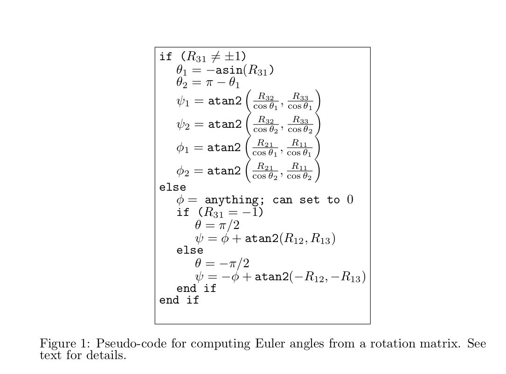

# 如何获取两个等价的euler角

[How can I find equivalent Euler angles?](https://math.stackexchange.com/questions/55508/how-can-i-find-equivalent-euler-angles)

https://math.stackexchange.com/questions/55508/how-can-i-find-equivalent-euler-angles

down voteaccepted

Are you constrained to using Euler angles? If you can decide freely what representation to use, [quaternions](http://en.wikipedia.org/wiki/Quaternions_and_spatial_rotation)would be preferable. In that representation, it's very easy to find which of two quaternions representing a rotation (which differ only by a sign) is closer to a given one.

With Euler angles, if you want the representation to be continuous, you can let the angles range over ℝ instead of restricting them to a single (half-)period. However, choosing the nearest of the equivalent representations will then be more complicated than with quaternions. Quite generally, a lot of things that are nasty, complicated and potentially numerically unstable with Euler angles become nicer and easier when you use quaternions.

[*Edit in response to the comments:*]

There are three equivalences, one obvious, another less obvious and a third only applicable in certain circumstances.

The obvious one is that you can always add multiples of 2*π* to any of the angles; if you let them range over ℝ, which you must if you want to get continuous curves, this corresponds to using ℝ3 as the parameter space instead of the quotient (ℝ/2*π*ℤ)3. This equivalence is easy to handle since you can change the three angles independently, that is, if you change one of them by a multiple of 2*π*, you directly get the same rotation without changing the other two parameters.

What's less obvious is that (referring to [this image](http://en.wikipedia.org/wiki/File%3aEulerangles.svg)) the transformation (*α*,*β*,*γ*)→(*α*+*π*,−*β*,*γ*+*π*) leads to the same rotation. (This is why, in order to get unique angles, *β* has to be limited to an interval of length *π*, not 2*π*.)  (不是很靠谱）

A third equivalence comes into play only if *β*≡0(mod*π*), since in this case *α* and *γ* apply to the same axis and changing *α*+*γ* doesn't change the rotation. If your rotations are arbitrary and have no reason to have *β*≡0, you won't need to consider this case, though it may cause numerical problems if you get close to *β*≡0(which is one good reason to use quaternions instead of Euler angles).

These three transformations generate all values of the Euler angles that are equivalent to each other. Remember that you also have to consider combinations of them, e.g. you can add multiples of 2*π* in (*α*+*π*,−*β*,*γ*+*π*) to get further equivalent angles.

