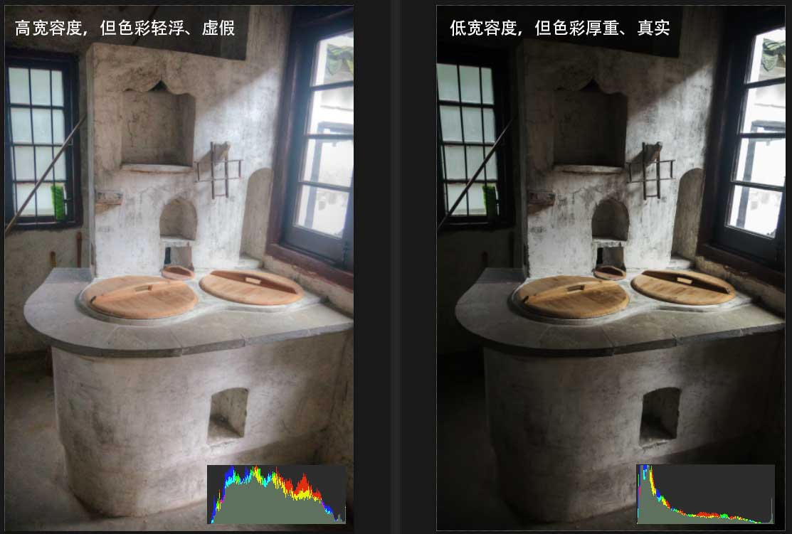

# 单反相机的宽容度和动态范围的区别在哪里

From: https://zhidao.baidu.com/question/2271491933472656948.html

研究来研究去，宽容度和动态范围说的其实是一回事儿……都是表示相机拍照的最亮和最暗之间的范围。

这两个概念来自不同领域。宽容度是银盐相机时代胶片能够正确感光被拍摄物体明暗之间的范围；动态范围概念来自电路放大器，是最大的不失真输出功率与静态噪声功率之间的差值。

需要说明一点，就是数码相机的动态范围可不是固定的！ISO不同，动态范围是不同的！

# 工业相机基本参数以及选型参考（二）

From: https://blog.csdn.net/dcrmg/article/details/52851913

- **分辨率**

相机每次采集图像的像素点数，一般对应于光电传感器靶面排列的像元数，如1920*1080。

- **像素深度**

每位像素数据的位数，常见的是8bit，10bit，12bit。分辨率和像素深度共同决定了图像的大小。例如对于像素深度为8bit的500万像素，则整张图片应该有500万*8/1024/1024=37M（1024bit=1KB，1024KB=1M）。增加像素深度可以增强测量的精度，但同时也降低了系统的速度，并且提高了系统集成的难度（线缆增加，尺寸变大等）。

- **最大帧率/行频**

相机采集和传输图像的速度，对于面阵相机一般为每秒采集的帧数（Frames/Sec），对于线阵相机为每秒采集的行数（HZ）。

- **曝光的方式和快门速度**

工业线阵相机都是逐行曝光的方式，可以选择固定行频和外触发同步的方式，曝光时间可以与行周期一致，也可以设定一个固定的时间；面阵相机有帧曝光、场曝光和滚动曝光几种常见方式，工业数字相机一般都提供外触发采图的功能，快门速度一般可到10ms，高速相机还会更快。

- **像元尺寸**

像元大小和像元数（分辨率）共同决定了相机靶面的大小。目前工业数字相机像元尺寸一般位3μm~10μm，一般像元尺寸越小，制造难度越大，图像质量也越不容易提高。

- **光谱响应特性**

是指该像元传感器对不同光波的敏感特性，一般响应范围为350nm~1000nm，一些相机在靶面前面加了一个滤镜，滤除红外线，如果系统需要对红外感光时可去掉该滤镜。

- **工业相机噪声**

噪声是指成像过程中不希望被采集到的，实际成像目标之外的信号。总体上分为两类，一类是由有效信号带来的散粒噪声，这种噪声对任何相机都存在；另一类是相机本身固有的与信号无光的噪声。它是由于图像传感器读出电路、相机信号处理与放大电路带来的固有噪声，每台相机的固有噪声都不一样。

- **信噪比**

相机的信噪比定义为图像中信号与噪声的比值（有效信号平均灰度值与噪声均方根的比值），代表了图像的质量，图像信噪比越高，相机性能和图像质量越好。

**如何选择合适的工业相机：**

- **1. CCD Or CMOS**

CCD提供很好的图像质量、抗噪能力，尽管由于增加了外部电路使得系统的尺寸变大，复制下提高，但在电路设计师可更加灵活，更好的提升CCD相机某些特别关注的性能。CCD更适合于对相机性能要求非常高而对成本控制不太严格的应用领域，如天文、高清晰的医疗X光影像、其他需要长时间曝光，对图像噪声要求比较严格的应用场合。

CMOS具有成品率高、集成度高、功耗小、价格低等优点。但本身图像的噪声比较多。目前的CMOS技术不断发展，已经克服了早期的许多缺点，发展到了图像品质方面可以与CCD技术相较量的水平。CMOS适用于要求空间小、体积小、功耗低而对图像噪声和质量要求不是特别高的场合。如大部分辅助光照明的工业检测应用、安防保安应用、和大部分消费性商业数码相机。目前CCD工业相机任然在视觉检测方案中占据主导地位。

- **2. 合适的分辨率**

根据目标的要求精度，反推出相机的像素精度。相机单方向分辨率=单方向视野范围除以理论精度。

例如对于视野大小为10*10mm的场合，要求精度为0.02mm/pixel,则当方向上分辨率=10/0.02=500.然而考虑到相机边缘视野的畸变以及系统的稳定性要求，一般不会只用一个像素单位对应一个测量精度值，一般选择倍数为4或者更高，这样相机单方向分辨率为2000，相机的分辨率=2000*2000=400万，所以选用500万像素的相机即可满足。

- **3. 足够的相机帧率**

当被测物体有运动要求时，要选择帧数较高的工业相机，一般来说分辨率越高，帧数越低。

- **4. 合适的镜头**

选择的镜头的支持CCD尺寸要大于等于相机CCD传感器芯片的尺寸，另外安装座是C、CS或F型接口也要匹配，同时考虑镜头的工作距离，是否留有足够空间等。

# **什么相机宽容度最牛？宽容度和动态范围别搞混了！**

http://www.360doc.com/content/17/0521/11/7443026_655786214.shtml

最近聊尼康有可能会在下半年发布的新机D820时，很多人都提到了宽容度和动态范围这两个词。到底宽容度和动态范围是什么呢？甚至有一种言论一直在流传，那就是佳能的宽容度不如尼康，事实真的这样吗？

　　一本正经的说宽容度

　　“宽容度”这个词其实来自胶片时代对胶片感光能力和表现能力的一个性能标准。

　　举个实例吧。户外晴天万里，你拍摄建筑，从肉眼看过去，什么云啦，建筑的细节啦，砖瓦啦，通通都很清楚。可是用相机拍出来就不是这么回事了，建筑物的阴影处一片漆黑，为什么会这样？

　　因为头顶的太阳光太强烈，而建筑的阴影光线又太暗，光线亮度的比值超过了相机所能表现的范围，所以只能兼顾一边。如果兼顾了天空，那么建筑阴影就会一片漆黑，缺乏暗部细节。如果建筑的曝光正常，那么天空就肯定是惨白一片，缺乏亮部细节了。

　　简单的说，宽容度就是一张照片记录最亮和最暗细节与层次的能力。宽容度高，意味着最亮和最暗的光比会比较大，不同光度的画面细节能被完好的被保留下来。反之，宽容度低的话，光比的展现只能局限在一个小区域内，这个区域外的画面就没办法记录下来。

　　动态范围和宽容度有啥关系

　　如果说宽容度是从胶片时代就有的名词的话，那么动态范围则是数码时代的称谓。

　　许多人因为HDR（高动态范围）照片效果，而混淆了这个概念，它只是把本该你看不见看不清的色阶变成了你能看见的色阶并且合成在一起，相片本身的色阶并不会变多。

　　动态范围代表着一张照片最亮到最暗的范围。一般情况下，动态范围越大，宽容度越高，两者呈正比关系。

　　比如同一个焦段不同的相机拍摄同一个场景的照片，在亮部不过曝的情况下暗部约亮越清晰，也就是动态范围越好。

　　什么时候需要挑战极限

　　主要是风光党，因为他们关注的重点不是细腻的色阶过渡而是高光和暗部的记录。

　　现在很多风光照都是通过堆叠来生成的。以耶稣光为例，耶稣光是一种自然状态中的光射现象，应该叫丁达尔效应，为了加强这个视觉效果，摄影师最常见的手法是降低一点曝光补偿，把ISO调到1600以上。

　　单张照片噪点肯定是不能看的，但如果把多张照片层叠在一起，噪点就会消失。这时候动态范围好的相机，优势就能体现，它直接决定了使用堆栈法需要拍摄的张数。也正是因为多这几挡动态范围，拍摄同样的张数，却可以挑战更大更夸张的光比极限。

　　当然，遇到一些稍纵即逝的场景，只能拍摄单张，挑战极限更具有意义。想必大家都知道安塞尔亚当斯的区域曝光法，提出的目的就是为了发挥宽容度优势，能够记录亮度更广泛的实际场景。

　　什么相机宽容度最牛

　　这个老狼一时半会也没这个精力和实力把市面上所有的相机买回来做测试，不过国外有一家叫做senscore网站，把这件事全给干了，而且干得非常漂亮，推出了一个相机曝光宽容度排名。

　　尼康>索尼>佳能，这个排名基本没有问题。佳能为什么排在最后一名呢？因为采用的外置ADC，没有内置，需要经过一段距离的传输，导致后端混入噪声，影响信噪比。这样设计的好处是采样精度高，适合高速传输，并且高感下热燥声小。

　　分享几点心得

　　1. 宽容度也不是越大就越好，如果宽容度超过了人眼的习惯，拍出来的照片看起来会很不自然，而且画质会下降。

　　2. JPG直接出图没有宽容度的说法，任何曝光加减，都是在吃掉细节，唯有RAW格式，才能保住细节。有人研究过当前的电子技术，数码缓冲区大概是33%，也就是说，正常拍摄的宽容度是7级的话，还有2级的缓冲区。

　　3. 暗部宽容度比亮部宽容度高，这才有了宁欠勿曝的说法。

# 相机高宽容度=色彩失真

通常都希望相机的宽容度高些以便为后期留下更多的调整空间，这也是评价相机好坏的一个重要指标。不过高宽度就没有负面作用了吗？我认为还是有的，主要就是对色彩准确还原来说，负面影响还是相当大的。相机高宽容度=色彩失真！

例如拍摄现场光照的动态范围从0ev到20ev，相机宽容度14ev，而常用的jpg的宽容度约6ev。6ev如何包含14ev呢？方法很多，但不论用什么方法都会造成信息丢失。

兼顾最暗和最亮：1-3-5-7-9-14；1-2-6-9-12-14等等。

强调色阶平滑：3-4-5-6-7-8；6-7-8-9-10-11等等。

可见在图像格式的宽容度小于相机宽容度的情况下，转换算法才是核心，而算法的选择是无限的，一般用户是无法驾驭的。高宽容度情况下，对照片的亮部、中间调、暗处必须做出取舍，这就意味着色彩失真，这也是HDR照片的色彩看上去不自然的原因。一般应用高宽容度的意义真的不是很大，尤其是人像摄影。对于严肃的人像摄影者来说，必须主动控制现场的光比，以使最终影调在适当的范围内。

以下几种情况高宽容度才有意义：

·追求影调丰富的黑白照片

·专业HDR文件格式配合HDR显示设备

·追求特效的大光比风景照片

·不强调真实还原色彩的超现实主义作品

1dx2宽容度上去了，色彩也尼康化了；D5宽容度下来了，人像色彩也进步了。这就很好地说明了宽容度对色彩的影响。

