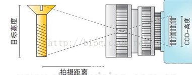
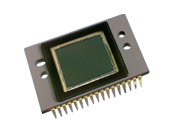

# 如何确定镜头CCD靶面尺寸？

From: https://blog.csdn.net/PINBODEXIAOZHU/article/details/47084633

  在组建机器视觉系统时，需要选用适合实际应用的产品。今天，中国机器视觉商城的培训课堂为您带来的是关于**工业镜头**CCD靶面尺寸的确定方法。

  在选择镜头时，我们通常要注意一个原则：即小尺寸靶面的CCD可使用对应规格更大的镜头，反之则不行。如果1/2″**CCD摄像机**采用对应1/3″镜头，则进光量会变小，不能完全覆盖整个CCD靶面，色彩会变差，甚至图像也会缺损;反之，如果1/3″CCD摄像机采用对应1/2″镜头，进光量会变大，就可以完全覆盖整个CCD靶面，色彩会变好，图像效果肯定会更好。但是在使用过程中，一般还是选规格相统一的产品，如1/2″CCD摄像机选用对应1/2″镜头，1/3″CCD摄像机选用对应1/3″镜头。

焦距是镜头的关键参数，为了在电荷耦合器件，也就是CCD上完整成像，我们需要为目标的高度和宽度计算焦距，较小的值为镜头焦距。

宽度的焦距=拍摄距离×CCD宽度／目标宽度+CCD宽度

高度的焦距=拍摄距离×CCD高度／目标高度+CCD高度

  **工业相机**CCD传感器尺寸大小：

  1/4 inch：(3.2mm×2.4mm)；

  1/3 inch：(4.8mm×3.6mm)；

  1/2 inch：(6.4mm×4.8mm)；

  2/3 inch：(8.8×6.6mm)；

  1 inch：(12.8mm×9.6mm)。

  根据公式计算出焦距，然后再根据CCD传感器的尺寸规格就可以判断选择合适的工业镜头产品。

# 工业CCD相机芯片靶面尺寸的计算

https://blog.csdn.net/mvtechnology/article/details/22580019

   最近不断的有客户在问SENSOR的尺寸计算是怎么得出来的，怎么按照正常的1英寸=25.4mm来换算的话，结果不对，针对此问题，度申科技总结如下： 

​    感光器件是工业相机用来感光成像的部件，相当于光学传统相机中的胶卷。

​    要了解 CCD 尺寸，首先必须先认识在工程师眼中 “1英吋”的定义是什么？

​    业界通用的规范就是 1英吋 CCD尺寸= 长 12.8mm × 宽 9.6mm = 对角线为 16mm 之对应面积。

​    透过“勾股定理”.可得出该三角之三边比例为 

4：3：5；换句话说，我无须给你完整的面积参数，只要给你该三角形最长一边长度，你就可以透过简单的定理换算回来。而且面积对角线长度就是16除以那个分母。

​    有了固定单位的 CCD 尺寸就不难了解余下 CCD Size 比例定义了，例如: 

​    1）1/2" CCD的对角线就是 1"的一半为8mm，面积约为 1/4；

​    2）1/4" CCD的对角线就是 1"的1/4，即为 4mm，面积约为1/16。

​    所以，得出这样的结论，就是1/2.5inch CCD感光面积<1/1.8inch。

​    

所以目前的趋势是在CCD尺寸不变甚至减小的前提下，尽量增加像素传感器的数量，以满足人们对像素无止境的要求。但是CCD尺寸不变，增加像素就意味着单个像素捕捉光线能力下降，从而会引发噪声增加、色彩还原不良、动态范围减小等问题。

​     CCD/CMOS尺寸越大，感光面积越大，成像效果越好。

​     

而相同尺寸的CCD/CMOS像素增加固然是件好事，但这也会导致单个像素的感光面积缩小，有曝光不足的可能。但如果在增加CCD/CMOS像素的同时想维持现有的图像质量，就必须在至少维持单个像素面积不减小的基础上增大CCD/CMOS的总面积。目前更大尺寸CCD/CMOS加工制造比较困难，成本也非常高。因此，CCD/CMOS尺寸较大的数码相机，价格也较高。感光器件的大小直接影响数码相机的体积重量。超薄、超轻的数码相机一般CCD/CMOS尺寸也小，而越专业的数码相机，CCD/CMOS尺寸也越大。

​     所以说：SENSOR在计算尺寸时，不是按简单的长度换算单位计算的（长度换算是：1英寸=25.4mm）**，****而是按1英寸=16mm算的**