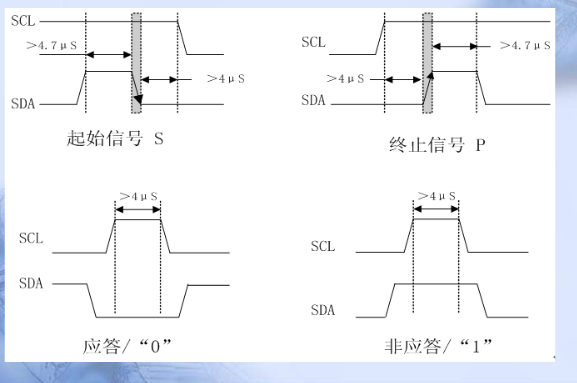
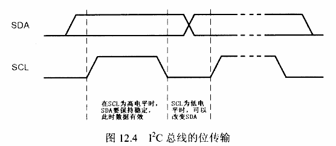
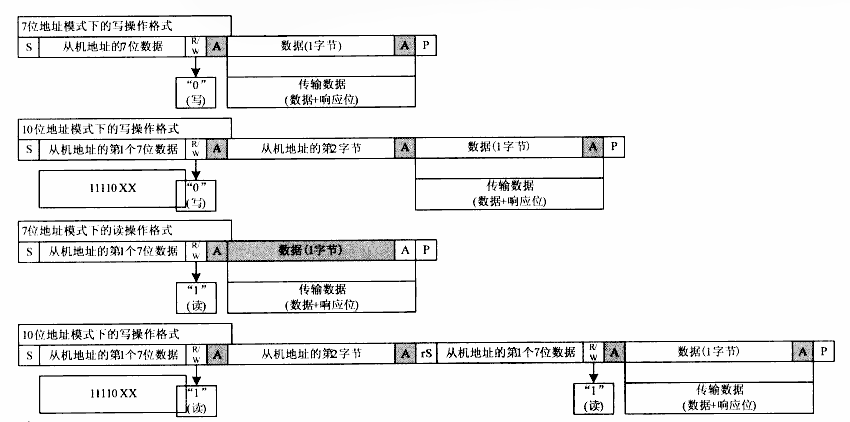

# IIC时序

 1.时序元素

 

S（开始）       SCL为高时  SDA由高变低

P（结束）       SCL为高时  SDA由低变高（数据传送完毕）

ACK（相应）    从设备接收到第八位，在第九位拉低SDA

 

数据传送       SCL为低时  SDA变化传送数据

2.IIC时序

 

多字节写：

 

S   7位设备地址|写+“ACK” 发送8位数据+“ACK”  发送8位数据+“ACK”   P

 

 

多字节读：

 

S   7位设备地址|读+“ACK” “读取8位数据”+ ACK  “读取8位数据”+ /ACK  P

  3.IIC设备时序（EEPROM）

 

​    随机读

 

​    1.发送设备地址、内部地址     S   7位设备地址|写+“ACK” 高8位内部地址+“ACK” 低8位内部地址 + “ACK”    P

​    2.读取数据                     S   7位设备地址|读+“ACK” “读取8为数据”+ACK   “读取8位数据”  +  /ACK      P

 

​    随机写

 

​    1.发送设备地址、内部地址、数据      S+  7位设备地址|写+“ACK” +高8位内部地址+“ACK” +低8位内部地址+“ACK” +8位数据+“ACK”  +8位数据+“ACK”  +P