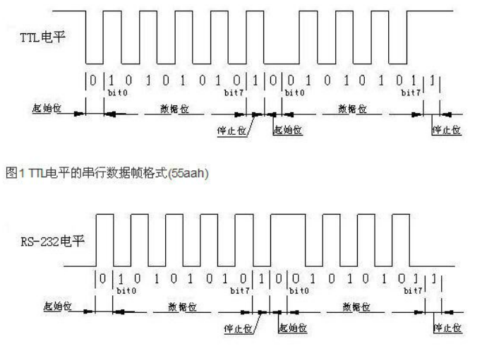

# 串口 TTL和RS232电平标准

1.TTL与RS-232电平相反

TTL        1：大于2.4V    0：小于0.4V

 RS-232     1：-3~-15       0：+3~+15

 2.串口时序

  |起始位 |数据位        |校验位 |结束位 |

​       0      5~8可选长度    可选    1  1/1.5/2长度可选

 

  每位时间=1/波特率

 

 

​    发送0x55   10101010

