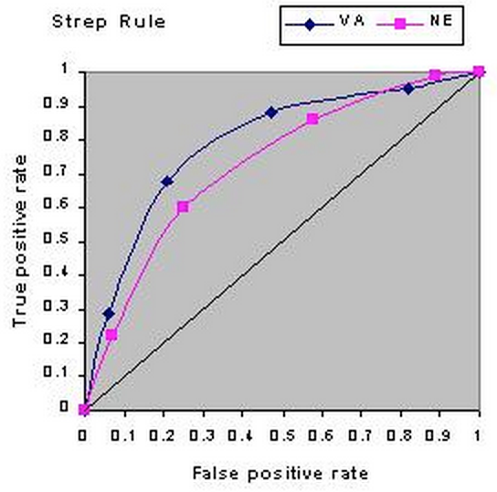

# true positive negative, false postive negative

表示分类正确：

- True Positive：本来是正样例，分类成正样例。
- True Negative：本来是负样例，分类成负样例。

表示分类错误：

false positive 是把正样例分类成负样例，叫误报, false recognitions

false negative 是把负样例分类成正样例，叫漏报, missed recognitions

ROC（Receiver Operating Characteristic）

很简单，就是把假阳率当x轴，真阳率当y轴画一个二维平面直角坐标系。然后不断调整检测方法（或机器学习中的分类器）的阈值，即最终得分高于某个值就是阳性，反之就是阴性，得到不同的真阳率和假阳率数值，然后描点。就可以得到一条ROC曲线。 

需要注意的是，ROC曲线必定起于（0，0），止于（1，1）。因为，当全都判断为阴性(-)时，就是（0，0）；全部判断为阳性(+)时就是（1，1）。这两点间斜率为1的线段表示随机分类器（对真实的正负样本没有区分能力）。所以一般分类器需要在这条线上方。

画出来大概是长下面这样（转自[这里](http://gim.unmc.edu/dxtests/roc3.htm 这里)）： 

