# 用甘特图做项目管理，让你的规划更清晰

时间：2018年

From: https://zhuanlan.zhihu.com/p/32866011

互联网上讨论生产力的文章很多，但几乎全是任务管理相关的，很难看到项目管理 App。

甘特图就是几乎没有被人介绍到的一个有力生产力工具。通过甘特图，可以一目了然看到一个项目里面的各个任务分别从什么时候开始什么时候结束，不同任务之间是否有时间重叠和依赖，以及哪些任务可以同时做哪些任务必需有先后顺序。

当你开始使用甘特图来规划任务，你就会发现你的生产力进入了另一个层次。

什么是甘特图

什么是甘特图呢？下面这张图就是甘特图。

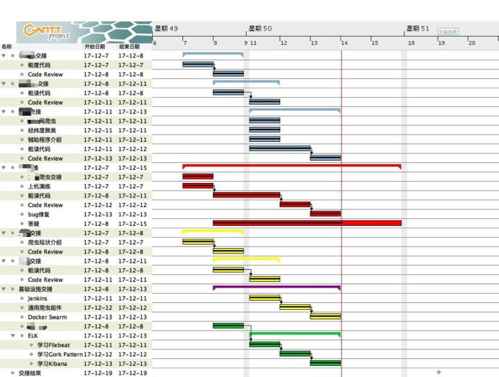

这张图是我 12 月离职做交接时候的甘特图。

- 不同的颜色表示不同的人
- 每一行表示一个任务
- 红色竖线表示今天应该完成的任务
- 任务与任务之间的黑色箭头表示任务之间的依赖关系，必需完成前面的才能完成后面的
- 带中心黑线的任务表示已经完成的任务

通过这一张甘特图，我能一眼看出以下信息：

1. 今天谁应该做什么任务
2. 这个任务从什么时候开始，到什么时候结束
3. 一个人在一段时间有哪些任务
4. 应该先做哪些任务再做哪些任务
5. 哪些任务可以同时做
6. 这个任务是否被其他任务依赖，如果是，那么这个任务就不能推迟，必需按时完成或者提前完成，否则会影响后面的任务
7. 每个任务已经完成多少还剩多少
8. 大任务下面有哪些子任务
9. 任务的里程碑是什么时候

为什么要用甘特图

使用甘特图，可以克服任务管理工具的几个缺陷。

少数派的文章喜欢介绍任务管理工具，很多人也喜欢用任务管理工具。任务管理 App，更是多不胜数，常见的 Things 3、Todoist、Any.do、Teambition、Trello……其中 Things 3 和 Todoist，本质上就像是一个增强版的提醒工具，你要做什么事情，填上去，设置好 Deadline，事情做完了勾掉。如下图所示。

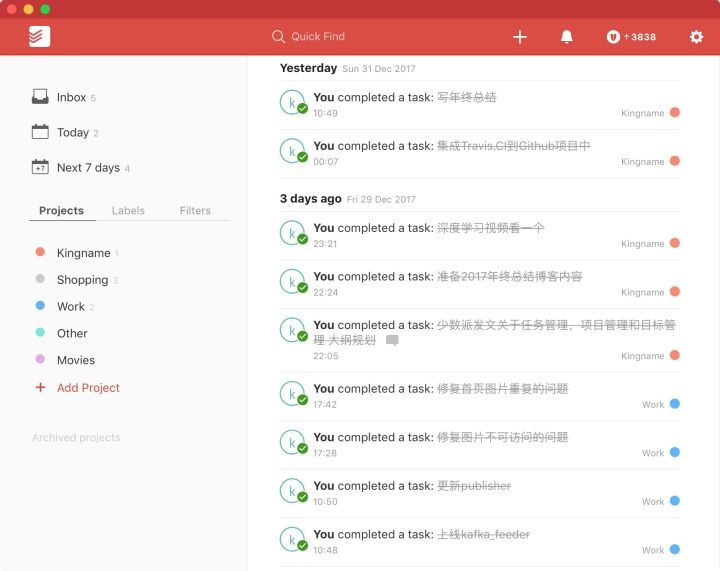

但这种类型的 App 有一个缺点——任务只有 未做 和 完成 两个状态，没有 正在做 的状态。

而 Teambition 与 Trello 稍微进步一点，引入了看板的概念，于是能够显示任务在各个阶段的状态，如下图所示。这张图是少数派的 Trello 看板，用来让作者选题。

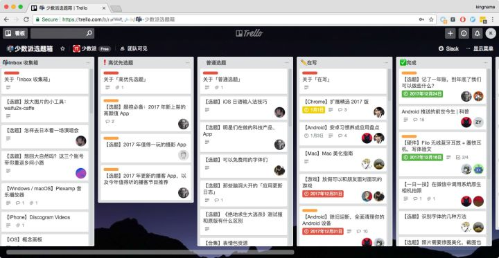

这种类型的 App 有一个很大的问题：你做了很多任务，但是你不知道你做这些任务是为了什么。任务管理类 App 适合用来记录和追踪各种琐碎的任务和相关性不强的任务。就像是少数派的每一篇文章，文章与文章之间不是一个系列的关系，他们各自独立，谁都可以领选题写文章，哪个选题先写哪个选题后写，关系不大。

一旦要规划一个项目，对于规划项目的人和做项目的人，用任务管理类 App 都会让人觉得使不上劲。对于做任务的人，看到每一个独立的任务，对项目没有整体的概念；对于规划项目的人，不知道任务是不是已经切分得足够细，是否有遗漏。举一个例子，下面是一些任务：

- 找 IT 申请服务器
- 配置 Dockerfile
- 配置 Docker Swarm
- 搭建 Jenkins
- 配置 Github Hook
- 选择三个 Repo 测试

现在看到上面的几个任务，你知道我是想做什么吗？我想实现持续集成（CI），实现开发人员把代码一推到 Github，系统自动使用 Jenkins 把代码拉到测试服务器，检查代码风格，做单元测试，做功能测试，自动生成 Code Review 申请发送给相关人员，Code Review 以后自动把代码集成到主干并部署。但是对于做任务的人，却很难根据上面的任务发现要做这个事情。对于规划任务的人，也很难发现是否漏掉了任务，以及是否其中的一个或者多个任务可以继续拆分。

再一个问题，在为每一个任务设定时间的时候，任务一旦多，很难把控每个任务的具体时长。也难以发现哪些任务可以同时做，哪些任务有依赖必需先做这个再做那个，前置任务必需按时完成。即使设置了任务优先级，但是对于同级的任务谁先做谁后做，你却无法把控，只有看 App 上哪个排前面就先做哪个。

我曾经有一篇文章，就是因为考虑到 Teambition 的这个问题，所以把 Teambition 与大纲工具 Workflowy 结合起来使用。文章地址为：[TeamFlowy——结合 Teambition 与 Workflowy](https://link.zhihu.com/?target=https%3A//sspai.com/post/41178)

但是，如果你使用了甘特图，你就可以克服任务管理 App 的这些缺陷。因为为了绘制出甘特图，你必需强迫自己完成以下几件事情：

1. 确定每一个任务的开始时间和结束时间
2. 确定任务的依赖关系
3. 分离可以同时运行的任务
4. 确定不同人的任务间的时间关系

当你根据以上的规则绘制好第一版甘特图以后，你会发现有些地方是可以继续调整的，但是这种调整，在你没有画图之前是不能发现的。于是你会在调整甘特图的过程中，让项目的规划越来越清晰。

怎么做甘特图

绘制甘特图不一定需要 App，你可以在纸上做甘特图，也可以用 Excel 来做。下面这张图是来自网络。

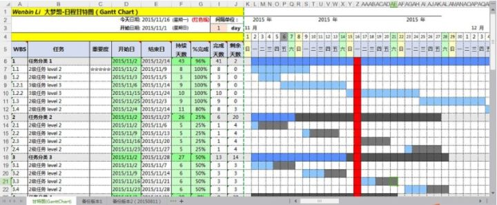

这是使用 Excel 做出来的效果，但是做起来稍显麻烦。

OmniPlan 和 MS Project 都是非常专业的甘特图制作软件，但是价格非常高。毕竟这是生产力软件，使用这个软件你是可以赚大钱的，自然软件本身就会比较贵。

开源的甘特图软件也有不少，不过不是功能不全就是界面丑陋。这里介绍一个相对比较完整的甘特图制作软件：GanttProject，除了长的比较丑，其他方面 GanttProject 很好用。

GanttProject 的官方网站为 [ganttproject.biz](https://link.zhihu.com/?target=http%3A//www.ganttproject.biz/)，在这里你可以下载到 macOS、Windows 或者 Linux 版本的软件。

GanttProject 运行以后的界面如下图所示。

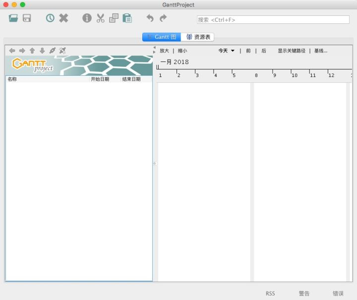

在左侧任务面板右键或者按下键盘 Command + T 就可以添加任务，Windows 和 Linux 对应的快捷键为 Ctrl + T。如下图所示。

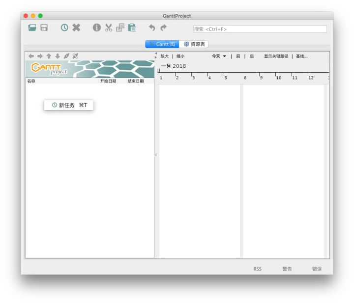

创建好了一个任务，它默认的开始时间和结束时间都是今天。在任务上面右键，选择 任务属性，可以打开任务属性设置界面，在这里可以设置任务的开始时间和任务时长。但是你不能设置任务结束时间。因为任务结束时间会根据开始时间和任务时长自动计算。如下图所示。

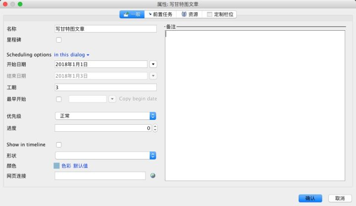

在这个界面，还可以设置任务的颜色，实现不同人不同颜色，或者不同项目不同颜色。也可以在这里更新任务进度。

创建多个任务，如果后面的任务依赖前面的任务，那么在右侧被依赖的任务色条上单击鼠标左键，按住并拖动到依赖它的任务上。依赖它的任务的起始时间自动就会变为被依赖任务的结束时间，如下图所示。此时，后一个任务只能设置任务的时长，不能修改任务的起始时间。

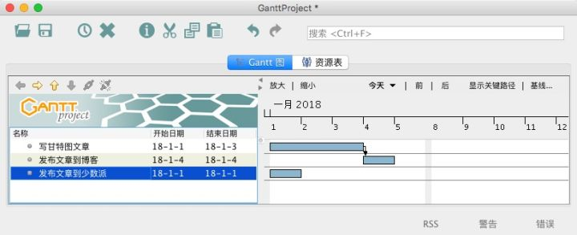

如果依赖关系设置错误，打开依赖任务的任务属性，定位到 前置任务 选项卡，在这里可以删除被依赖的任务或者修改被依赖任务。如下图所示。

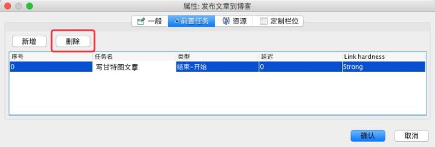

如果你需要移动任务的顺序，鼠标单击选中它，按下键盘上的 Alt + 方向键上或下 即可移动任务。

我认为甘特图有一个非常重要的元素，就是竖直红线，它指向了今天的任务。要打开这跟红线，需要单击菜单栏的 编辑 - 设置，定位到 甘特图设定，在 将今天显示为红色 点选为 是，如下图所示。

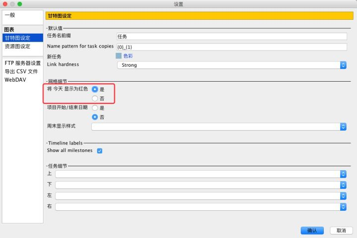

单击确定回到甘特图的界面，可以看到图中出现了一条红色竖线。这条竖线指向了今天应该做的事情。如下图所示。

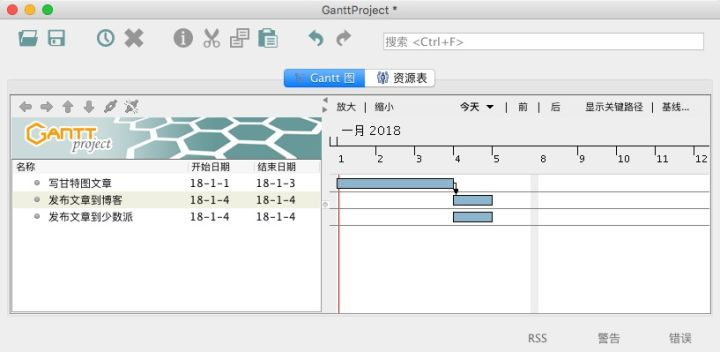

每天打开甘特图，这根红线都会指向当天。

GanttProject 可以把做好的甘特图导出为图片，CSV、HTML 或者 PDF 文件。单击 项目 - 导出，点选 Raster图像文件，并单击 下一步，如下图所示。

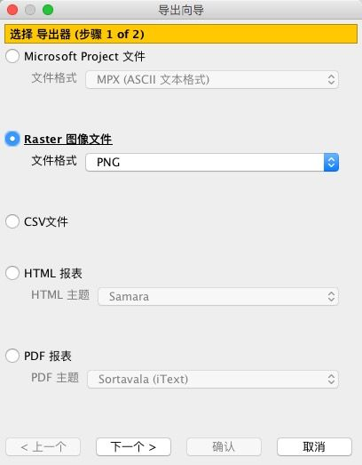

设置保存路径和甘特图的日期范围即可导出为 PNG 文件，以方便分享。

GanttProject 还有更多功能，你可以安装以后慢慢研究。