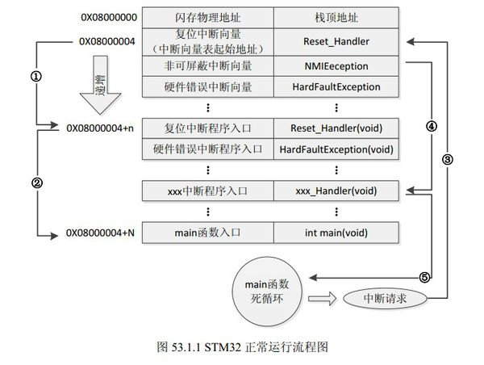
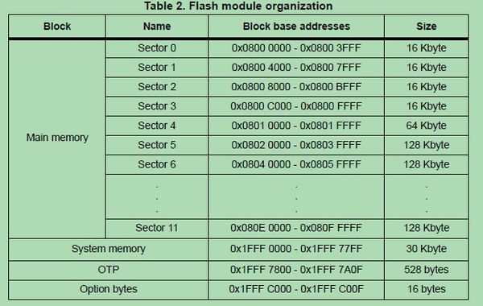
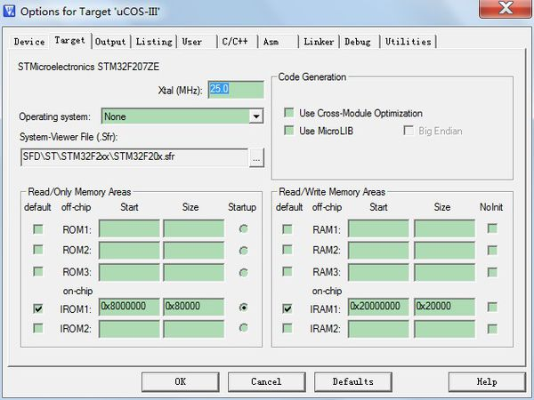
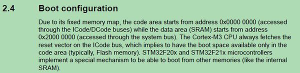
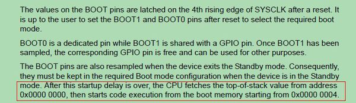

# IAP bootloader 0x0800 0000

正点原子的IAP例程，应该能帮到你一点。

STM32的内部闪存（FLASH）地址起始于0x08000000，一般情况下，程序文件就从此地

址开始写入。此外STM32是基于Cortex-M3内核的微控制器，其内部通过一张“中断向量表”

来响应中断，程序启动后，将首先从“中断向量表”取出复位中断向量执行复位中断程序完成

启动，而这张“中断向量表”的起始地址是0x08000004，当中断来临，STM32的内部硬件机

制亦会自动将PC指针定位到“中断向量表”处，并根据中断源取出对应的中断向量执行中断

服务程序。 

 在图53.1.1中，STM32在复位后，先从0X08000004地址取出复位中断向量的地址，并跳

转到复位中断服务程序，如图标号①所示；在复位中断服务程序执行完之后，会跳转到我们的

main函数，如图标号②所示；而我们的main函数一般都是一个死循环，在main函数执行过程

中，如果收到中断请求（发生重中断），此时STM32强制将PC指针指回中断向量表处，如图

标号③所示；然后，根据中断源进入相应的中断服务程序，如图标号④所示；在执行完中断服

务程序以后，程序再次返回main函数执行，如图标号⑤所示

因为[STM32](https://www.baidu.com/s?wd=STM32&tn=44039180_cpr&fenlei=mv6quAkxTZn0IZRqIHckPjm4nH00T1Y4nvcvmvPbnA7buhPBmHIb0ZwV5Hcvrjm3rH6sPfKWUMw85HfYnjn4nH6sgvPsT6KdThsqpZwYTjCEQLGCpyw9Uz4Bmy-bIi4WUvYETgN-TLwGUv3EnH6krjDzn1nvnjnzP1nYPjR3r0)设计的Flash起始地址是在0x0800 0000位置开始的。全部代码都只能在从这里开始存储。详见[STM32](https://www.baidu.com/s?wd=STM32&tn=44039180_cpr&fenlei=mv6quAkxTZn0IZRqIHckPjm4nH00T1Y4nvcvmvPbnA7buhPBmHIb0ZwV5Hcvrjm3rH6sPfKWUMw85HfYnjn4nH6sgvPsT6KdThsqpZwYTjCEQLGCpyw9Uz4Bmy-bIi4WUvYETgN-TLwGUv3EnH6krjDzn1nvnjnzP1nYPjR3r0) referenc manual手册第54页。

那既然从这里才能存储代码，就必须在MDK里设置Flash地址为0x0800 0000，下面是MDK设置页面，这个应该都看到过：

这样就还有一个问题，理论上，CM3中规定上电后CPU是从0地址开始执行，但是这里中断向量表却被烧写在0x0800 0000地址里，这是因为[STM32](https://www.baidu.com/s?wd=STM32&tn=44039180_cpr&fenlei=mv6quAkxTZn0IZRqIHckPjm4nH00T1Y4nvcvmvPbnA7buhPBmHIb0ZwV5Hcvrjm3rH6sPfKWUMw85HfYnjn4nH6sgvPsT6KdThsqpZwYTjCEQLGCpyw9Uz4Bmy-bIi4WUvYETgN-TLwGUv3EnH6krjDzn1nvnjnzP1nYPjR3r0)的Flash是从0x0800 0000开始才有。但SMT32也不能破坏ARM定下的“规矩”，所以它做了一个启动映射的过程，就是和芯片上总能见到的BOOT0和BOOT1有关了，当选择从主Flash启动模式后，芯片一上电，Flash的0x0800 0000地址被映射到0地址处，不影响CM3内核的读取，所以这时的CM3既可以在0地址处访问中断向量表，也可以在0x0800 0000地址处访问中断向量表，而代码还是在0x0800 0000地址处存储的。这就是最难理解的地方，其实，这是基本上所有[ARM芯片](https://www.baidu.com/s?wd=ARM芯片&tn=44039180_cpr&fenlei=mv6quAkxTZn0IZRqIHckPjm4nH00T1Y4nvcvmvPbnA7buhPBmHIb0ZwV5Hcvrjm3rH6sPfKWUMw85HfYnjn4nH6sgvPsT6KdThsqpZwYTjCEQLGCpyw9Uz4Bmy-bIi4WUvYETgN-TLwGUv3EnH6krjDzn1nvnjnzP1nYPjR3r0)采用的启动映射方法。[ARM7](https://www.baidu.com/s?wd=ARM7&tn=44039180_cpr&fenlei=mv6quAkxTZn0IZRqIHckPjm4nH00T1Y4nvcvmvPbnA7buhPBmHIb0ZwV5Hcvrjm3rH6sPfKWUMw85HfYnjn4nH6sgvPsT6KdThsqpZwYTjCEQLGCpyw9Uz4Bmy-bIi4WUvYETgN-TLwGUv3EnH6krjDzn1nvnjnzP1nYPjR3r0)，[ARM9](https://www.baidu.com/s?wd=ARM9&tn=44039180_cpr&fenlei=mv6quAkxTZn0IZRqIHckPjm4nH00T1Y4nvcvmvPbnA7buhPBmHIb0ZwV5Hcvrjm3rH6sPfKWUMw85HfYnjn4nH6sgvPsT6KdThsqpZwYTjCEQLGCpyw9Uz4Bmy-bIi4WUvYETgN-TLwGUv3EnH6krjDzn1nvnjnzP1nYPjR3r0)没有内部Flash的通常都是这样做的。这个过程出自STM32 referenc manual手册，里面是有说明的：

这样就还有一个问题，理论上，CM3中规定上电后CPU是从0地址开始执行，但是这里中断向量表却被烧写在0x0800 0000地址里，这是因为[STM32](https://www.baidu.com/s?wd=STM32&tn=44039180_cpr&fenlei=mv6quAkxTZn0IZRqIHckPjm4nH00T1Y4nvcvmvPbnA7buhPBmHIb0ZwV5Hcvrjm3rH6sPfKWUMw85HfYnjn4nH6sgvPsT6KdThsqpZwYTjCEQLGCpyw9Uz4Bmy-bIi4WUvYETgN-TLwGUv3EnH6krjDzn1nvnjnzP1nYPjR3r0)的Flash是从0x0800 0000开始才有。但SMT32也不能破坏ARM定下的“规矩”，所以它做了一个启动映射的过程，就是和芯片上总能见到的BOOT0和BOOT1有关了，当选择从主Flash启动模式后，芯片一上电，Flash的0x0800 0000地址被映射到0地址处，不影响CM3内核的读取，所以这时的CM3既可以在0地址处访问中断向量表，也可以在0x0800 0000地址处访问中断向量表，而代码还是在0x0800 0000地址处存储的。这就是最难理解的地方，其实，这是基本上所有[ARM芯片](https://www.baidu.com/s?wd=ARM芯片&tn=44039180_cpr&fenlei=mv6quAkxTZn0IZRqIHckPjm4nH00T1Y4nvcvmvPbnA7buhPBmHIb0ZwV5Hcvrjm3rH6sPfKWUMw85HfYnjn4nH6sgvPsT6KdThsqpZwYTjCEQLGCpyw9Uz4Bmy-bIi4WUvYETgN-TLwGUv3EnH6krjDzn1nvnjnzP1nYPjR3r0)采用的启动映射方法。[ARM7](https://www.baidu.com/s?wd=ARM7&tn=44039180_cpr&fenlei=mv6quAkxTZn0IZRqIHckPjm4nH00T1Y4nvcvmvPbnA7buhPBmHIb0ZwV5Hcvrjm3rH6sPfKWUMw85HfYnjn4nH6sgvPsT6KdThsqpZwYTjCEQLGCpyw9Uz4Bmy-bIi4WUvYETgN-TLwGUv3EnH6krjDzn1nvnjnzP1nYPjR3r0)，[ARM9](https://www.baidu.com/s?wd=ARM9&tn=44039180_cpr&fenlei=mv6quAkxTZn0IZRqIHckPjm4nH00T1Y4nvcvmvPbnA7buhPBmHIb0ZwV5Hcvrjm3rH6sPfKWUMw85HfYnjn4nH6sgvPsT6KdThsqpZwYTjCEQLGCpyw9Uz4Bmy-bIi4WUvYETgN-TLwGUv3EnH6krjDzn1nvnjnzP1nYPjR3r0)没有内部Flash的通常都是这样做的。这个过程出自STM32 referenc manual手册，里面是有说明的：

还要注意，这个中断向量表是可以在程序中再次被映射的。控制它的就是CM3已经规定的NVIC寄存器SCB->VTOR。在STM32库中给出的启动代码里，startup_stm32f10x_hd.s文件里，第146行，是上电后读取中断向量表中的复位中断位置，并执行复位[中断处理](https://www.baidu.com/s?wd=中断处理&tn=44039180_cpr&fenlei=mv6quAkxTZn0IZRqIHckPjm4nH00T1Y4nvcvmvPbnA7buhPBmHIb0ZwV5Hcvrjm3rH6sPfKWUMw85HfYnjn4nH6sgvPsT6KdThsqpZwYTjCEQLGCpyw9Uz4Bmy-bIi4WUvYETgN-TLwGUv3EnH6krjDzn1nvnjnzP1nYPjR3r0)代码，代码如下：

; Reset handler

Reset_Handler  PROC

​        EXPORT Reset_Handler       [WEAK]

​        IMPORT __main

​        IMPORT SystemInit

​        LDR   R0, =SystemInit

​        BLX   R0        

​        LDR   R0, =__main

​        BX   R0

​        ENDP

 注意复位后第一个被执行的是SystemInit代码，这个代码在库目录下的system_stm32f10x.c文件里，它初始化了时钟，NVIC等一系列操作，这里摘要与中断向量有关的代码：

void SystemInit (void)

{

......

\#ifdef VECT_TAB_SRAM

 SCB->VTOR = SRAM_BASE | VECT_TAB_OFFSET; /* Vector Table Relocation in Internal SRAM. */

\#else

 SCB->VTOR = FLASH_BASE | VECT_TAB_OFFSET; /* Vector Table Relocation in Internal FLASH. */

\#endif 

}

可以看出中断向量重映射是一个选择性编译，通常宏定义VECT_TAB_SRAM都没有被定义，所以这里执行结束后，SCB->VTOR就是FLASH_BASE了，值为0x0800 0000。以后CM3再取中断向量里，就会根据SCB->VTOR的设置，从这里取向量执行了。中断向量自此终于转正。

注意这时连__[main函数](https://www.baidu.com/s?wd=main函数&tn=44039180_cpr&fenlei=mv6quAkxTZn0IZRqIHckPjm4nH00T1Y4nvcvmvPbnA7buhPBmHIb0ZwV5Hcvrjm3rH6sPfKWUMw85HfYnjn4nH6sgvPsT6KdThsqpZwYTjCEQLGCpyw9Uz4Bmy-bIi4WUvYETgN-TLwGUv3EnH6krjDzn1nvnjnzP1nYPjR3r0)都还没进，看起来中断向量的重映射位置还是够早的。