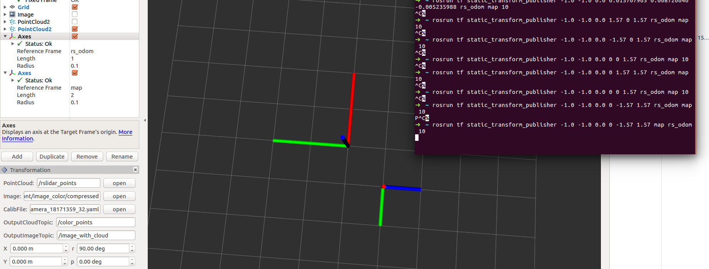

# Eigen 的 euler角和ROS tf  euler是一致的

从autoware里面的雷达标定的代码上看，

eulerAngles(2, 1, 0)， 顺序是这样的， 2， 1， 0

  std::cout << "This transformation can be replicated using:" << std::endl;

  std::cout << "rosrun tf static_transform_publisher " << translation_vector.transpose() << " "

​            << rotation_matrix.eulerAngles(2, 1, 0).transpose() << " /" << parent_frame_ << " /" << child_frame_

​            << " 10" << std::endl;

而, Eigen中的roll pitch yaw 则为

eulerAngles(0, 1, 2)

但是这边的顺序是yaw pitch roll

static_transform_publisher x y z yaw pitch roll frame_id child_frame_id period_in_ms

从这边讲，是一致的

rosrun tf static_transform_publisher -1.0 -1.0 0.0 0 -1.57 1.57 rs_odom map 10

从图中可以看出，tf这边的x y z yaw pitch roll 是在frame_id为固定坐标(旋转过程中都是以这个原始坐标系，先旋转roll , 然后pitch, 然后yaw, 在平移x, y, z 到达child_frame_id。