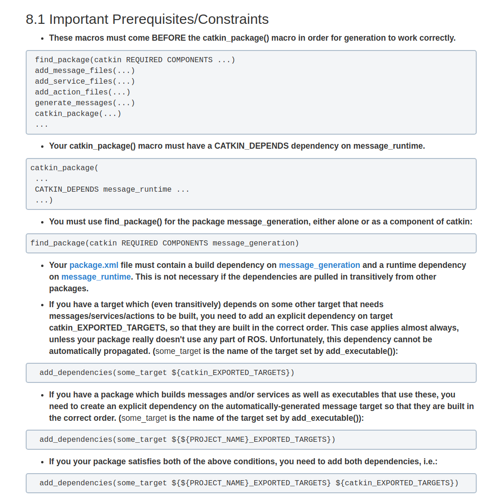

# 关于ROS msg编译先后依赖问题

http://answers.ros.org/question/188982/message-headers-wont-build-first/

**message headers won't build first**

**总结：**

**CMakeLists.txt中lib和exe后面加上**

http://wiki.ros.org/catkin/CMakeLists.txt

调用别人的package，  add_dependencies(some_target ${catkin_EXPORTED_TARGETS})

在自己的package中调用自己产生的msg, srv, action，加add_dependencies(some_target ${${PROJECT_NAME}_EXPORTED_TARGETS})，还需要

package.xml中加入

  <build_depend>message_generation</build_depend>

  <run_depend>message_runtime</run_depend>

find_package(catkin REQUIRED COMPONENTS message_generation)

catkin_package( ... CATKIN_DEPENDS message_runtime ... ...)

