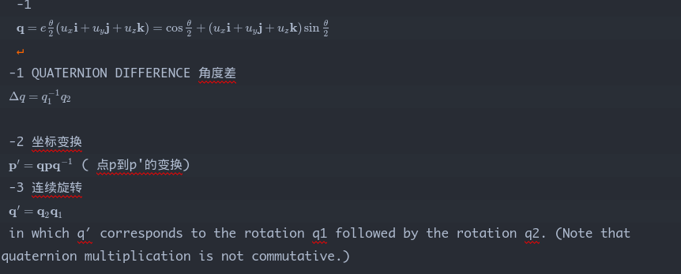
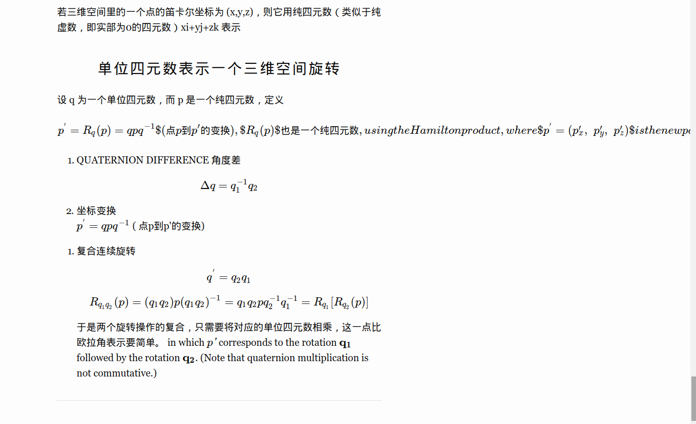

# 四元素乘以向量总结

Eigen中四元素乘法有三种方式，三种方式计算结果等价：

1. q*qv*q.inverse()                                         (循环10000次耗时13ms)    （其中v 要转换成四元素qv.w() = 0, qv.vec() = v， 计算出来的也是四元素，v_result = q_result.vec();

2. q.toRotationMatrix() * v                            (循环10000次耗时28ms)

3. q*v                                                            (循环10000次耗时16ms)

