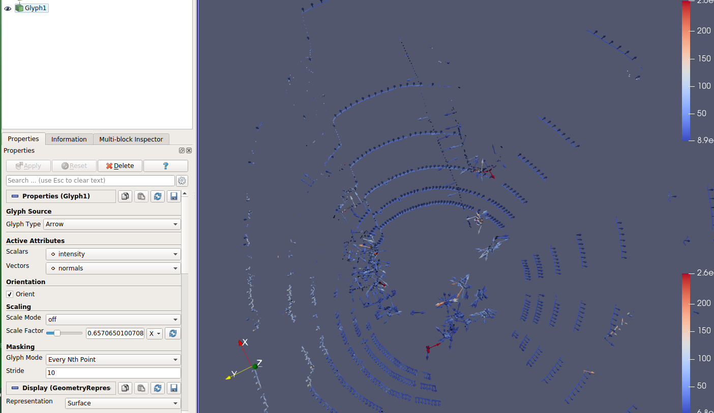
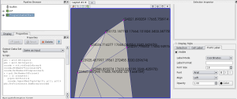

# 显示点云工具paraview

显示带法向量的点云vtk



显示选取点的坐标

https://xrunhprof.wordpress.com/2012/07/17/display-point-coordinates-in-paraview/

Here is how to display point coordinates in Paraview. First create a *programmable filter* with the following code:

```c++
pdi = self.GetInput()
pdo = self.GetOutput()
coords = vtk.vtkDoubleArray()
coords.SetName("Coordinates")
coords.SetNumberOfComponents(3)
n = pdi.GetNumberOfPoints()
for i in xrange(n):
   p=pdi.GetPoint(i)
   coords.InsertNextTuple3(p[0], p[1], p[2])
pdo.GetPointData().AddArray(coords)
```

Then select points and enable point labels in the *Selection inspector*:



PCL 显示选取点的坐标

   pcl_viewer -use_point_picking xxx.pcd ( SHIFT + left click: select a point (start with -user_point_picking)