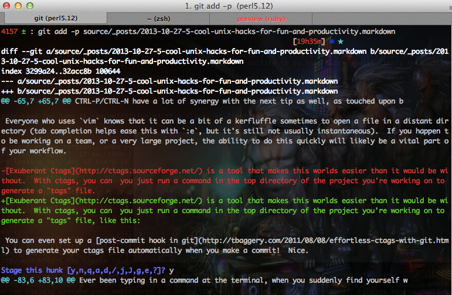

# git add -p

**git add -p**

如果你已经使用git很长一段时间了，你很可能遇到过原子提交这个概念了。本质上，这个概念指一次提交只包含相关操作，不包含逻辑上不相关的事情。例如，你对一个类的改动和相关的单元测试应该在一个提交中，而对另一个不同类的操作你应该放在另一个提交中。

但是，如果在一个文件中包含多个不相关操作的时候应该怎么办，或者你会想要把他们放在多个提交中，这样你可以单独对他们进行revert操作？或者你在一个文件中写了很多log日志的语句，但是你不希望将这些语句提交到项目中去怎么办？通常人们使用的git命令是达不到这个要求的：

```shell
$ git diff
diff --git a/some-file.c b/some-file.c
index f383179..09e4e35 100644
--- a/some-file.c
+++ b/some-file.c
@@ -2,6 +2,8 @@
 
 int main(void) {
        printf("doing some stuff\n");
-       printf("doing some more stuff\n");
+       do_some_stuff();
+       printf("doing some unrelated stuff\n");
+       do_some_unrelated_stuff();
        return 0;
 }
$ git add some-file.c
$ git commit
[master 1938906] some unrelated stuff, cramming it all in one commit 'cause I'm lazy
 1 file changed, 3 insertions(+), 1 deletion(-)
$ echo "Whoops we just committed unrelated stuff.  Not very modular of us."
```

git add的 -p （代表patch）参数对于这种场景是非常有用的。这个会告诉git add，我想要做一个特殊的add操作，并且这个命令有个非常好的交互界面能让我们明确指定我们想要操作文件中的哪个部分。git会将所有的变动自动分块，你可以使用y或者n来通过或者拒绝这个分块，或者你也可以使用s将它切成更细粒度的块。如果git不能自动将变动分成你希望的块的话，你可以使用e（edit）选项来指定更多细节。




这个帖子中有更多关于git add -p的细节：How can I commit only part of a file in git （http://stackoverflow.com/questions/1085162/how-can-i-commit-only-part-of-a-file-in-git）

补充说明：一些评论指出，-p参数也可以和其他的一些命令，比如git check –，在一起使用。因此你可以将文件的一部分恢复回来，而保持其他的部分的变化。很方便吧！