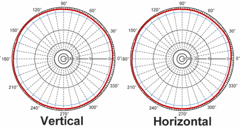
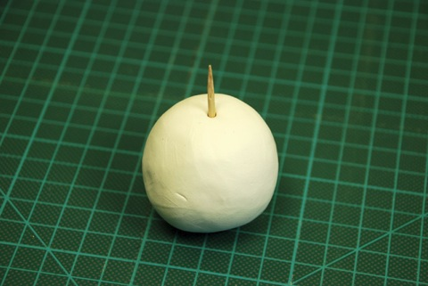
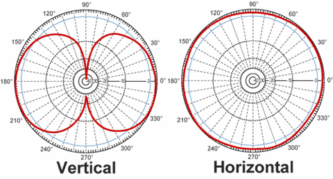
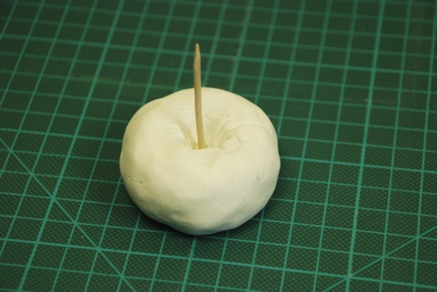
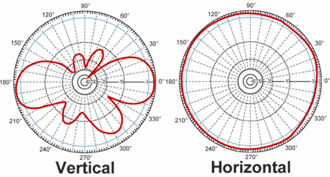
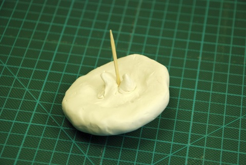
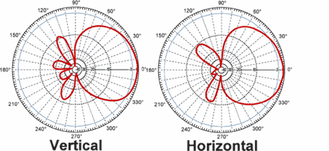

# Understanding antenna gain

http://rcexplorer.se/educational/2009/06/understanding-antenna-gain/

I get a lot of questions regarding what antenna is best for their FPV setup. A common misprecepion is that a higher gain antenna is simply more effective than a low gain one; this is not true.

First of we need to understand what the dBi value of an antenna means:

“The decibel (dB) is a logarithmic unit of measurement that expresses the magnitude of a physical quantity (usually power or intensity) relative to a specified or implied reference level.”

**Simply put, dB is a unit of power (intensity).**

The “i” in “dBi” specifies the reference level which in this case is a hypothetical isotropic antenna that transmits a signal in a perfect sphere. This antenna has a gain of 0 dBi since it’s the reference point. In real life it’s impossible to make such an antenna.

dB is a logarithmic unit and every 3 dB increase is a doubling of the power (intensity). This means that if you switch out your theoretic 0 dBi antenna for a 3 dBi antenna you will gain the same amount of extra range as doubling your transmitter output power. A 3 dB increment means an extended range by 1.414, a 6 dB increment means an extended range by 2 (1.414*1.414) **But it comes at a price.**

To explain the trade-of let us compare some radiation patterns.

This is the radiation pattern of the hypothetical isotropic antenna. (**0 dBi gain**)

As you can see from the picture this makes a perfect sphere. To clarify I made some clay models:

(The toothpick represents the axis at which the antenna is placed at the middle of. That means that in this case, the antenna is in the middle of the sphere.)

________________________________________________________________________________

Now lets compare it to a standard omnidirectional **3 dBi** rubber duck antenna:

This makes the shape of a donut. As long as you are inside of the red lines you have a 3 dBi gain, but if you get outside of the line you have no reception. This means that you can fly twice as far away from your self as long as you don’t fly outside of the reception field. You can’t fly as high as with the 0dBi antenna, and you can’t fly directly above you.

________________________________________________________________________________

Here is a omnidirectional **7 dBi** rubber duck antenna:

This antennas transmission field is like a very flat donut. Which means that you can fly twice as far from your self compared to the 3 dBi antenna but you can’t fly very high. In fact I think this is a terrible antenna for FPV flying.

________________________________________________________________________________

**8dBi** Patch antenna:

With the 8dBi Patch antenna, you can fly even farther away but now all the reception is in front of you. You can fly far ahead, but not above you, beside you or behind you.

________________________________________________________________________________

**Thus we come to the conclusion that a higher gain antenna will be more directional.**

Your transmitter puts ut out a fixed amount of power, the antenna does not change that, it’s only distributing that power.

So what antenna should you choose?

The antenna on your airplane should **ALWAYS** be a low dBi omnidirectional antenna since the airplane is moving around in all directions. (You don’t want an antenna on the airplane that will loose contact when you make a turn.)

On the receiver a patch antenna would be a good choice if you want to fly far away from yourself in one direction. If you plan on flying around yourself, a 3dBi omnidirectional or something similar would be the best choice.