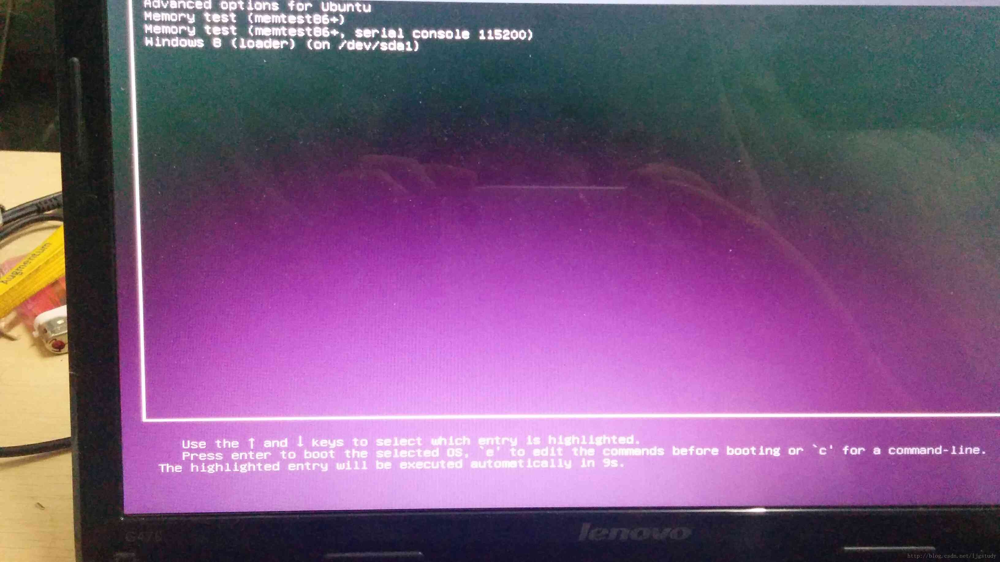
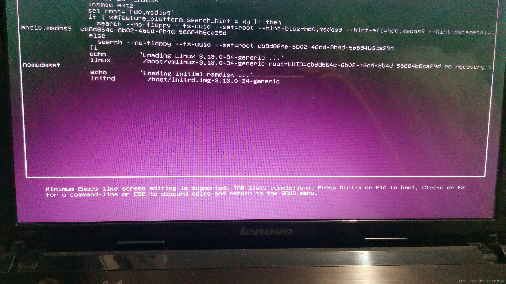

# Ubuntu14.04忘记root密码的解决方法

对于windows操作[系统](https://www.2cto.com/os/)，如果忘记管理员密码，其实还是蛮好解决的。

最简单的一种方式就是使用PE--电脑店，老毛桃等等，都可以很完美的解决这个问题。

如果是[Linux](https://www.2cto.com/os/linux/)操作系统的话，其实也是很简单 -- 单用户登陆。下面以Ubuntu14.04来简单演示一下具体的操作流程。

1. 开机，如下图所示（没有装[虚拟机](https://www.2cto.com/os/xuniji/)，手机拍的图片凑合这看把）：

2. 此时会有一个选项：Advanced Options for Ubuntu, 选中直接回车 ，如下图：

   

3. 看到里面有很多选项，选中后面带recovery mode的选项（千万别回车！），按下字母e，如下图：

4. 

   4.关键的时候到了， 倒数第四行，会看到一行linux /boot/vm.......ro recovery \nomodeset，

step 1: 删除recovery \nomodeset

step 2: 在这行的最后添加 quiet splash rw init=/bin/bash

5. 按F10, 启动。

6. 如果没有意外你会进入系统， 输入：passwd, 系统会提示你输入新的密码，结束。

本文为原创内容，亲测可用！欢迎转载，转载请注明出处：blog.csdn.net/ljgstudy,谢谢配合！

