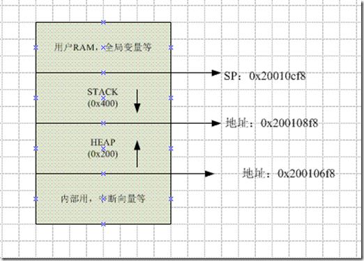

# stm32 堆和栈(stm32 Heap & Stack)

http://www.it610.com/article/4048573.htm

关于堆和栈已经是程序员的一个月经话题，大部分有是基于os层来聊的。

 

那么，在赤裸裸的单片机下的堆和栈是什么样的分布呢？以下是网摘：

 

 

刚接手STM32时，你只编写一个

int main()

{

while(1);

}

BUILD://Program Size: Code=340 RO-data=252 RW-data=0 ZI-data=1632 

编译后，就会发现这么个程序已用了1600多的RAM，要是在51单片机上，会心疼死了，这1600多的RAM跑哪儿去了，

分析map,你会发现是堆和栈占用的，在startup_stm32f10x_md.s文件中，它的前面几行就有以上定义，

这下该明白了吧。

 

Stack_Size  EQU  0x00000400

Heap_Size  EQU  0x00000200

 

以下引用网上资料 理解堆和栈的区别

（1）栈区（stack）：由编译器自动分配和释放，存放函数的参数值、局部变量的值等，其操作方式类似

于数据结构中的栈。

（2）堆区（heap）：一般由程序员分配和释放，若程序员不释放，程序结束时可能由操作系统回收。分配

方式类似于数据结构中的链表。

（3）全局区（静态区）（static）：全局变量和静态变量的存储是放在一块的，初始化的全局变量和静态

变量在一块区域，未初始化的全局变量和未初始化的静态变量在相邻的另一块区域。程序结束后由系

统自动释放。

（4）文字常量区：常量字符串就是存放在这里的。

（5）程序代码区：存放函数体的二进制代码。

例如：

int a=0;  //全局初始化区

char *p1;  //全局未初始化区

main()

{

int b;  //栈

char s[]="abc";  //栈

char *p3= "1234567";  //在文字常量区Flash

static int c =0 ;  //静态初始化区

p1= (char *)malloc(10);  //堆区

strcpy（p1,"123456");  //"123456"放在常量区

}

所以堆和栈的区别：

stack的空间由操作系统自动分配/释放，heap上的空间手动分配/释放。

stack的空间有限，heap是很大的自由存储区。

程序在编译期和函数分配内存都是在栈上进行，且程序运行中函数调用时参数的传递也是在栈上进行。

 

\------------------------------------------------------------------------------------------------------

1.堆和栈大小

定义大小在startup_stm32f2xx.s

Stack_Size EQU 0x00000400

AREA STACK, NOINIT, READWRITE, ALIGN=3 

Stack_Mem SPACE Stack_Size 

__initial_sp

; Heap Configuration 

; Heap Size (in Bytes) <0x0-0xFFFFFFFF:8> 

;

Heap_Size EQU 0x00000200

AREA HEAP, NOINIT, READWRITE, ALIGN=3 

__heap_base

2.堆和栈位置

通过MAP文件可知

HEAP 0x200106f8 Section 512 startup_stm32f2xx.o(HEAP) 

STACK 0x200108f8 Section 1024 startup_stm32f2xx.o(STACK)

__heap_base 0x200106f8 Data 0 startup_stm32f2xx.o(HEAP) 

__heap_limit 0x200108f8 Data 0 startup_stm32f2xx.o(HEAP) 

__initial_sp 0x20010cf8 Data 0 startup_stm32f2xx.o(STACK)

显然 Cortex-m3资料可知：__initial_sp是堆栈指针，它就是FLASH的0x8000000地址前面4个字节（它根据堆栈大小，由编译器自动生成）

显然堆和栈是相邻的。

3.堆和栈空间分配

栈：向低地址扩展

堆：向高地址扩展

显然如果依次定义变量

先定义的栈变量的内存地址比后定义的栈变量的内存地址要大

先定义的堆变量的内存地址比后定义的堆变量的内存地址要小

4.堆和栈变量

栈：临时变量，退出该作用域就会自动释放

堆：malloc变量，通过free函数释放

另外：堆栈溢出，编译不会提示，需要注意

 

\------------------------------------------------------------------------------------------------------

 

如果使用了HEAP，则必须设置HEAP大小。 

如果是STACK，可以设置为0，不影响程序运行。 

IAR STM8定义STACK,是预先在RAM尾端分配一个字节的区域作为堆栈预留区域。 

当程序静态变量，全局变量，或者堆与预留堆栈区域有冲突，编译器连接的时候就会报错。 

你可以吧STACK设置为0,并不影响运行。(会影响调试，调试会报堆栈溢出警告)。 

其实没必要这么做。 

一般程序，（在允许范围内）设置多少STACK，并不影响程序真实使用的RAM大小， 

(可以试验，把STACK设置多少，编译出来的HEX文件都是一样), 

程序还是按照它原本的状态使用RAM，把STACK设置为0，并不是真实地减少RAM使用。 

仅仅是欺骗一下编译器，让程序表面上看起来少用了RAM。 

而设置一定size的STACK，也并不是真的就多使用了RAM，只是让编译器帮你 

检查一下，是否能够保证有size大小的RAM没有被占用，可以用来作为堆栈。 

以上仅针对IAR STM8.

 

\------------------------------------------------------------------------------------------------------

 

从以上网摘来看单片机的堆和栈是分配在RAM里的，有可能是内部也有可能是外部，可以读写；

 

**栈**：存函数的临时变量，即局部变量，函数返回时随时有可能被其他函数栈用。所以栈是一种分时轮流使用的存储区，

   编译器里定义的Stack_Size，是为了限定函数的局部数据活动的范围，操过这么范围有可以跑飞，也就是栈溢出；

   Stack_Size不影响Hex，更不影响Hex怎么运行的，只是在Debug调试时会提示错。栈溢出也有是超过了国界进行

   活动，只要老外没有意见，你可以接着玩，有老外不让你玩，你就的得死，或是大家都死（互相撕杀），有的人写

  单片机代码在函数里定义一个大数组 int buf[8192]，栈要是小于8192是会死的很惨。

 

**堆**：存的是全局变量，这变量理论上是所有函数都可以访问的，全局变量有的有初始值，但这个值不是存在RAM里的，是

   存在Hex里，下载到Flash里，上电由代码（编译器生成的汇编代码）搬过去的。有的人很“霸道”，上电就霸占已一块很

  大的RAM（Heap_Size），作为己有(malloc_init)，别人用只能通过他们管家借(malloc)，用完还得换(free)。所以 

  一旦有“霸道”的人出现是编译器里必须定义Heap_Size，否则和他管家借也没有用。

 

**总之**：堆和栈有存在RAM里，他两各分多少看函数需求，但是他两的总值不能超过单片机硬件的实际RAM尺寸，否则只能

   到海里玩（淹死了）或是自己打造船接着玩(外扩RAM)。

[stm32 堆和栈(stm32 Heap & Stack)【worldsing笔记】](http://www.it610.com/article/4048573.htm)